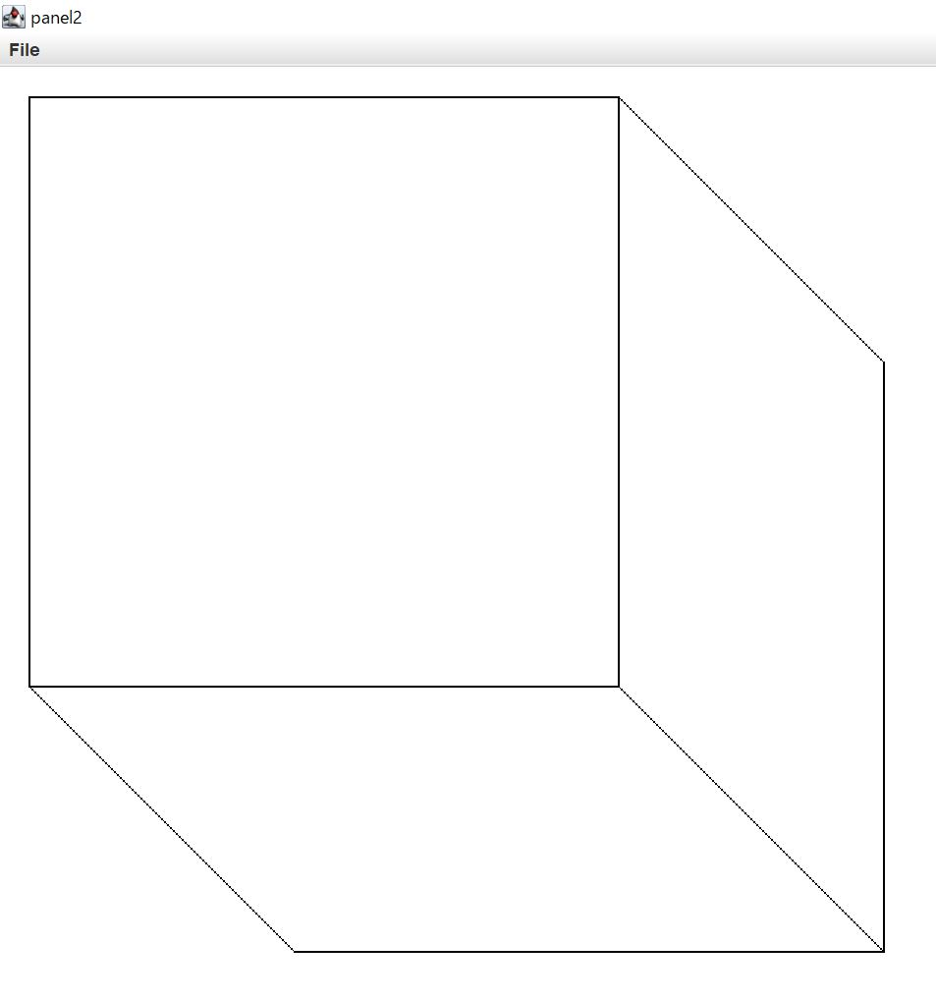

# Java
今までに作成したJavaのソースコードを公開しています。
## TouchyWindowInstruct.java
プログラムを起動すると画面に「Click in this window.」と表示され、クリックすると「I'm Touched」に表示が変わるプログラムです。

## Scribbles.java
マウスをクリックした時に図のような図形オブジェクトが表示されるプログラムです。

## Daiamonds.java
画面に正方形を組み合わせてひし形を表示させるプログラムです。

## Cube.java
サイコロ状の物体を画面に移すプログラムです。

## Focus.java
ウィンドウ上にマウスカーソルが移動したら「The cursor is inside.」と表示し、ウィンドウ上からマウスカーソルが離れると「The cursor is outside」と表示されるプログラムです。
